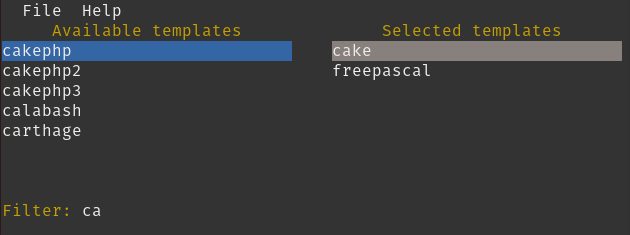

# Using gig-gen (.gitignore generator)

## List available template names with an optional filter.
Run `gig-gen list` on the command line to list the names of available templates. 
Include a parameter to filter the list to only include templates that _contain_ that string, 
for example `gig-gen list rust` will only show templates that contain the string "rust".

## Generate a `.gitignore` file from templates.
Run `gig-gen generate` followed by one or more template names on the command line to fetch a `.gitignore` file 
for the given templates. The program will write the file's contents to stdout on the terminal.

## Pick templates interactively and generate a .gitignore file (default).
Run `gig-gen` or `gig-gen --interactive` to display the available templates in a text-mode user interface.

*This screenshot shows the list of available templates filtered on "ca",
with the `cake` and `freepascal` templates selected.*

You may select one or more of the available templates to add it to the selected template list and then generate a 
`.gitignore` file for the selected templates.

- Press `Tab' to switch keyboard focus between the list of available and selected templates.
- You may type in a filter to be applied to the list of available templates. Press `Esc` to clear the filter.
- To select a template, click it in the list of available templates with the mouse, or highlight it in the list 
using the arrow keys and press `Enter`.
- Click on a template in the list of selected templates with the mouse to remove it from the list, or 
  highlight it in the list and press `Enter`.
- Press `Ctrl+S` to save the selected template or templates to the `.gitignore` file
  in the current directory. If there is already a `.gitignore` file there,
  the program will prompt you to replace it, append to it, or to cancel the
  operation.
- Press `Ctrl+Q` to quit the program without generating a `.gitignore` file.

## Get help
You can get help from the command line:
> gig-gen help

> gig-gen help list
 
> gig-gen help generate
 
> gig-gen help interactive
